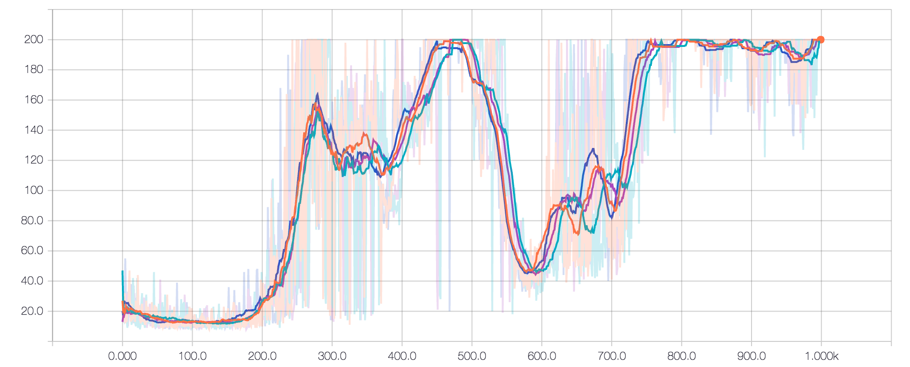
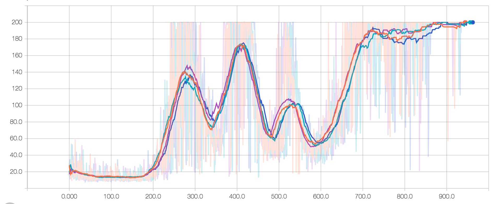
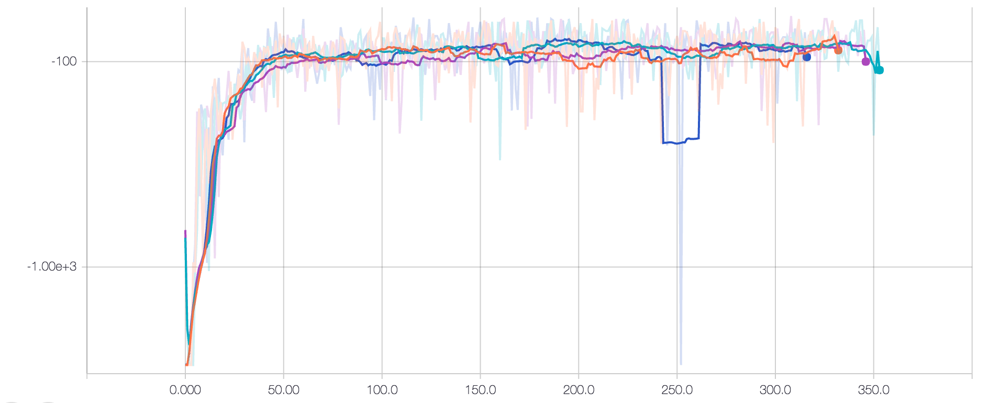
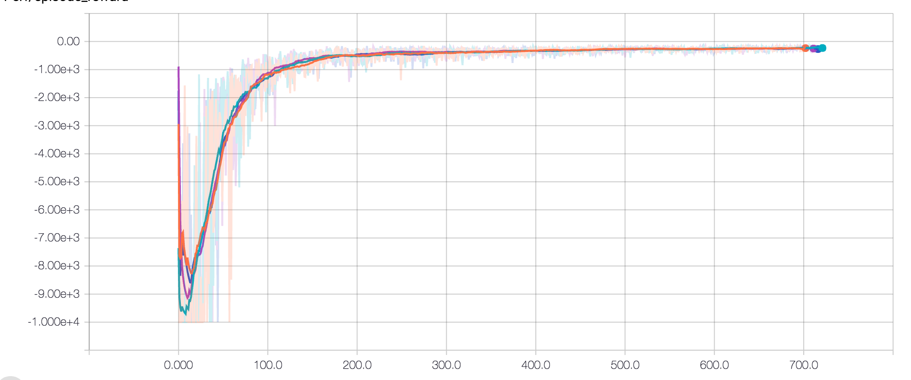

## Asynchronized Advantage Actor-Critic

Following paper: Asynchronous Methods for Deep Reinforcement Learning [(https://arxiv.org/pdf/1602.01783.pdf)](https://arxiv.org/pdf/1602.01783.pdf)

#### Cartpole-v0 result 

`> python cartpole_a3c.py`

The following graph shows the episode rewards (# workers: 4, entropy loss: 0.2)

The following graph shows the episode rewards (# workers: 4, entropy loss: 0.0)

#### Acrobot-v1 result 

`> python acrobot_a3c.py`

The following graph shows the episode rewards (# workers: 4, entropy loss: 0.2)

#### MountainCar-v0 result

`> python mountaincar_a3c.py`

The following graph shows the episode rewards (# workers: 8, entropy loss: 1.0, tmax=15)

#### References

- Openai's A3C implementation ([https://github.com/openai/universe-starter-agent](https://github.com/openai/universe-starter-agent))
- Arthur Juliani's blog post ([https://medium.com/emergent-future/simple-reinforcement-learning-with-tensorflow-part-8-asynchronous-actor-critic-agents-a3c-c88f72a5e9f2](https://medium.com/emergent-future/simple-reinforcement-learning-with-tensorflow-part-8-asynchronous-actor-critic-agents-a3c-c88f72a5e9f2))
